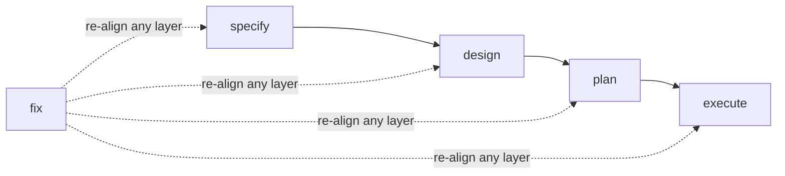

# Agent Skills

A collection of reusable agent skills, tools, and workflows designed to extend LLM capabilities and enable autonomous task execution.

## Installation

Skills are installed using the [`skills` CLI](https://github.com/vercel-labs/skills).

**Install all skills:**

```bash
npx skills add emiliosheinz/agent-skills
```

**Install a single skill:**

```bash
npx skills add emiliosheinz/agent-skills --skill <skill-name>
```

By default, skills are installed locally to the current project. Use `--global` to install them to your user directory instead, making them available across all projects.

```bash
# Local (current project only)
npx skills add emiliosheinz/agent-skills

# Global (all projects)
npx skills add emiliosheinz/agent-skills --global
```

## Available Skills

| Skill | Description |
|-------|-------------|
| <nobr>`commit-message-generator`</nobr> | Generates Conventional Commit messages from staged changes in any git repository, and can auto-stage + group unstaged changes into a sequence of commits. Use when asked to write a commit message, generate a commit, draft a commit for staged changes, commit the current work, or when the user says "commit", "commit message", "commit for staged changes", or "conventional commit". |
| <nobr>`create-adr`</nobr> | Creates Architecture Decision Records (ADRs) — concise, durable documents that capture the context, decision, and consequences of significant architectural choices so future team members understand *why* things are the way they are. TRIGGER when: the user asks to create or write an ADR, document a decision, record why something was chosen, capture an architectural decision, or preserve the reasoning behind a finalized technical choice. SKIP for: decisions that have not been made yet (use `/create-rfc`), implementation planning or breaking work into tasks (use `/forge plan`), or general documentation that is not a decision record. |
| <nobr>`create-rfc`</nobr> | Creates structured Request for Comments (RFC) documents that propose a change, compare alternatives against explicit decision criteria, and drive aligned decisions across teams. TRIGGER when: the user asks to create or write an RFC, draft a proposal, compare options, align stakeholders, get approval for a significant change, or propose a technical/process/product/vendor/policy change before deciding. SKIP for: decisions that have already been made (use `/create-adr` to record them), implementation planning or breaking work into tasks (use `/forge plan`), or informal one-off asks that don't need stakeholder alignment. |
| <nobr>`diagnose`</nobr> | Root-causes complex bugs through a structured loop and saves a verified fix proposal — it diagnoses, it never fixes. Builds a fast deterministic feedback loop, reproduces, then probes ranked falsifiable hypotheses with parallel subagents and confirms the cause adversarially before writing the report. Use when a bug, error, crash, exception, failing or flaky test, regression, or unexplained behavior needs root-causing — especially when it is intermittent, subtle, cross-system, or resisted a first fix. |
| <nobr>`forge`</nobr> | Spec-driven development workflow that takes a change from problem to shipped, verified code in four phases: specify, design, plan, execute — plus a `fix` command to correct course mid-stream. Auto-sizes from one-line fixes to multi-repo refactors. Invoke with `/forge specify|design|plan|execute|fix`. TRIGGER when: the user asks to ship/build/implement a feature, write a PRD or spec or requirements, design architecture, write a technical design, break work into tasks or an implementation plan, run TDD or write acceptance criteria, or correct/adjust an in-flight change — a misstated requirement, a design or implementation detail that's wrong, or a bug found while testing. SKIP for: trivial one-off edits the user already has fully specified, pure code review, or questions about how forge itself works. |

## Spec-Driven Development with `forge`

`forge` runs the whole decision-to-implementation pipeline as four explicit phases under
one skill, plus a `fix` command that re-enters the flow to correct course. You invoke one
phase at a time; each does its work, updates shared state, and **recommends** the next
phase without auto-running it. Depth **auto-sizes** to the change.



| Phase | Verb | Question it answers | Output |
|-------|------|---------------------|--------|
| Specify | `/forge specify <name>` | What is the problem, and what must we build? | `.specs/<slug>/spec.md` |
| Design | `/forge design` | What are the architecture, contracts, and gates for "done"? | `.specs/<slug>/design.md` |
| Plan | `/forge plan` | What are the phases of tasks, and what runs in parallel? | `.specs/<slug>/plan.md` |
| Execute | `/forge execute` | Turn the plan into verified, committed code | working code |
| Fix | `/forge fix <change>` | Something's wrong mid-stream — re-align it end-to-end | aligned artifacts + code |

### Auto-sizing

Forge adapts from one-line fixes to multi-repo refactors. The first phase to run records
the size in `state.md`; each phase scales its depth and tells you which phases to skip:

- **quick** (one file/function) — inline spec → `execute` (skip design and plan)
- **standard** (one component) — full spec → light design → phased plan → execute
- **complex** (crosses components/repos) — the full pipeline with every gate

### Flexible entry points

Start at whichever phase fits — a verb with no prior artifacts derives just enough context
to do its job. `/forge specify` for a fresh problem, `/forge design` when requirements are
already clear, `/forge plan` straight from a known design, `/forge execute` for a small
change.

### Lateral skills

`/create-rfc` and `/create-adr` are not tied to any phase — use them whenever a significant
decision needs proposing or recording.

- **Decision** — `/create-rfc`: should we do X or Y? Which approach?
- **Record** — `/create-adr`: why did we choose X over Y?
